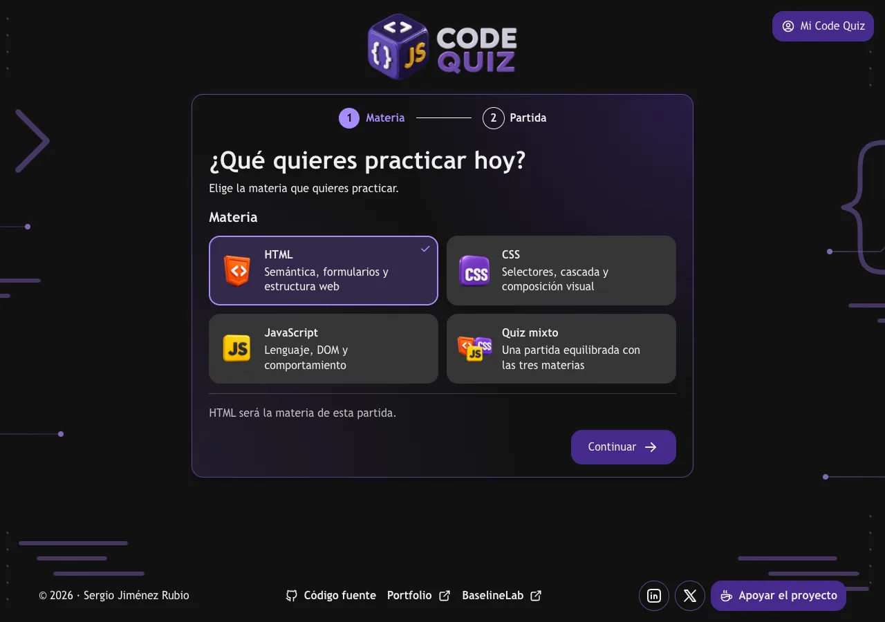
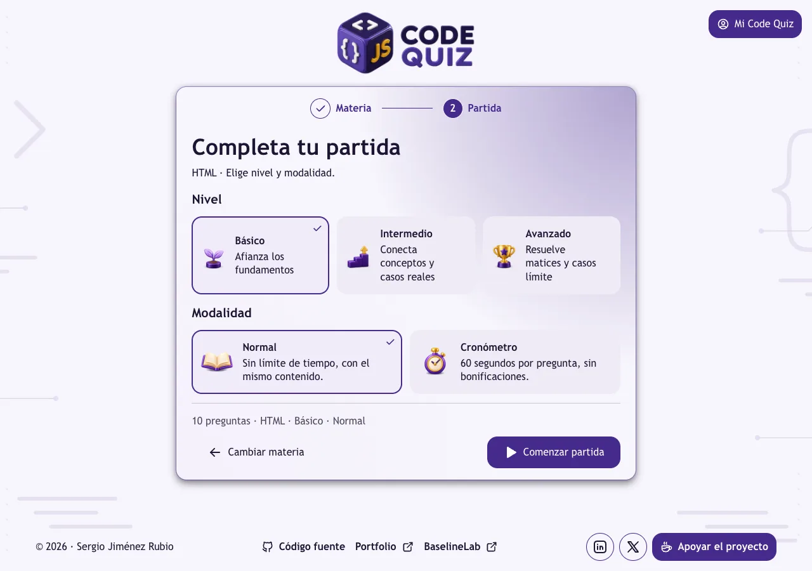
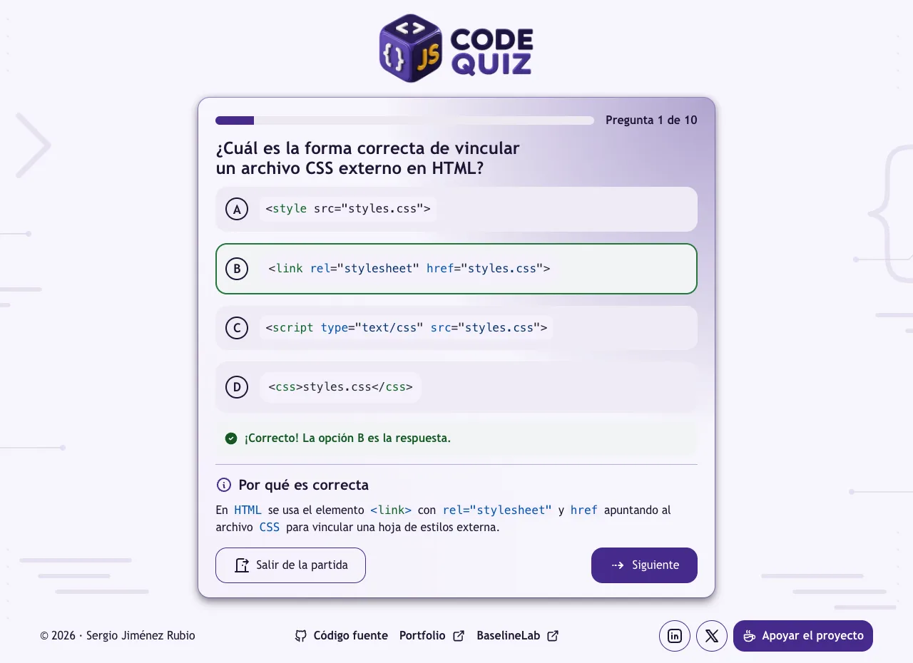

# Code Quiz

Practica HTML, CSS y JavaScript en español con preguntas de opción única, respuestas explicadas y una revisión al terminar. Cada partida tiene diez preguntas y puedes elegir una materia o combinar las tres.

**[Jugar a Code Quiz](https://codequiz-game.vercel.app/)** · [Contribuir](CONTRIBUTING.md) · [Ver el código](https://github.com/sergio-jr-dev/Code-Quiz)



## Qué puedes hacer

- Elegir HTML, CSS, JavaScript o un quiz mixto, y jugar en nivel básico, intermedio o avanzado.
- Practicar en modo Normal o Cronómetro. El tiempo disponible depende del nivel y, si se agota, la pregunta se marca como incorrecta para que puedas revisar su explicación.
- Recibir feedback inmediato, leer por qué es correcta una respuesta y repasar las diez preguntas al finalizar.
- Repetir la configuración o practicar solo los fallos en el orden en que aparecieron.
- Consultar tus mejores resultados por materia, nivel y modalidad en «Mi Code Quiz», donde también puedes elegir tema claro, oscuro o automático y activar los efectos sonoros. El sonido está desactivado de inicio.
- Jugar con teclado, foco visible y estados que se comunican también con texto. Las animaciones respetan la preferencia de movimiento reducido.

La aplicación funciona sin cuenta ni backend. Guarda en el navegador la configuración, el progreso de las partidas normales, los mazos de preguntas, las mejores marcas y las preferencias. No guarda un historial de partidas. Una partida con cronómetro en curso vuelve al menú al recargar.

| Configura la partida                                                                          | Aprende con cada respuesta                                                                                       |
| --------------------------------------------------------------------------------------------- | ---------------------------------------------------------------------------------------------------------------- |
|  |  |

## Catálogo de preguntas

El catálogo incluye **180 preguntas**: veinte por cada combinación de HTML, CSS y JavaScript con los tres niveles. Cada partida selecciona diez preguntas sin repetir dentro de la ronda. Las partidas consecutivas consumen primero las preguntas aún no vistas de esa configuración; el quiz mixto distribuye las diez entre las tres materias en proporción 4/3/3 y rota la materia con la pregunta adicional.

Los niveles siguen una progresión editorial, desde fundamentos hasta casos límite; no representan una dificultad calibrada con datos de jugadores. El contenido y sus explicaciones viven en `src/data/bank/`, y `src/data/questionCatalog.ts` compone el catálogo de producción. Las pruebas verifican su integridad y cobertura.

## Proyecto

Code Quiz está construido con React 19, TypeScript, Vite 8, Zustand y Vitest. La estructura principal es:

```text
src/components/   Interfaz, partida, resultado y panel personal
src/data/bank/    Preguntas por materia
src/lib/          Reglas de partida, selección, validación y persistencia
src/stores/       Estado y acciones del quiz y las preferencias
src/types/        Contratos de preguntas y partida
specs/            Especificaciones y decisiones de implementación
```

Si quieres corregir una pregunta, proponer otra o mejorar la aplicación, consulta [CONTRIBUTING.md](CONTRIBUTING.md) antes de abrir un issue o una pull request.

## Autoría y créditos

Creado por **Sergio Jiménez Rubio**. Puedes encontrarme en [mi portfolio](https://sergiojimenez.vercel.app/), [LinkedIn](https://www.linkedin.com/in/sergio-jim%C3%A9nez-rubio/) y [X](https://x.com/sergiojr_dev). También desarrollo [BaselineLab](https://baselinelab.dev/), un proyecto para aprender HTML y CSS de forma interactiva.

La [identidad visual](DESIGN.md), los logos y la imagen social forman parte del proyecto. Los efectos sonoros proceden de [UI SFX soft](https://github.com/romainsimon/uisfx/tree/main/packages/uisfx/sounds/soft) y sus archivos de audio están publicados bajo [CC0 1.0](https://github.com/romainsimon/uisfx/blob/main/LICENSE-AUDIO).

## Licencia

El proyecto se distribuye bajo la [licencia MIT](LICENSE).
