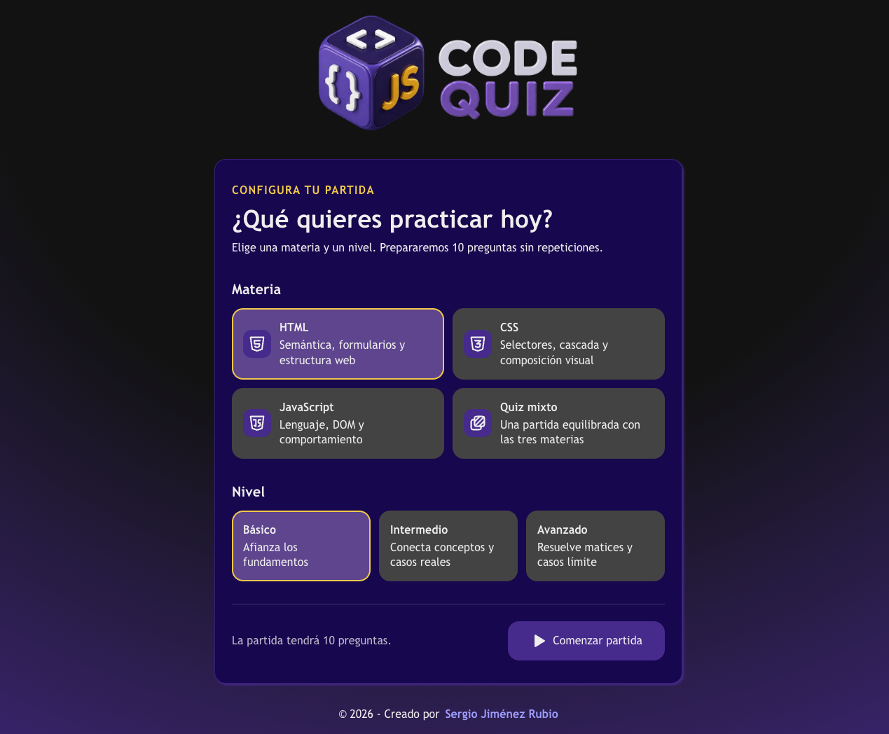

# Code Quiz

Aplicación educativa en español para practicar HTML, CSS y JavaScript con preguntas de opción única, feedback inmediato y explicaciones.

**[Abrir Code Quiz](https://codequiz-game.vercel.app/)**



## Flujo actual

- Menú para elegir HTML, CSS, JavaScript o un quiz mixto.
- Niveles básico, intermedio y avanzado.
- Partidas de 10 preguntas compatibles, sin duplicados dentro de la ronda.
- Mazo por configuración: las siguientes partidas consumen preguntas no vistas antes de iniciar otro ciclo.
- Modo mixto equilibrado 4/3/3, con rotación de la materia que aporta la cuarta pregunta.
- Progreso sincronizado mediante barra nativa y texto «Pregunta N de 10».
- Respuestas A–D en una sola columna, con radios nativos, foco visible y una banda de feedback que no altera su tamaño.
- Código escapado: MicroLighter resalta solo bloques completos y los términos técnicos inline se declaran como unidades completas en preguntas, respuestas y explicaciones.
- Posiciones correctas equilibradas y distractores barajados por ID.
- Cierre visual con anillos de progreso e iconos 3D para aciertos, fallos y precisión, además de logos por materia.
- Revisión de todas las respuestas con navegación numerada fija y estado visible.
- Navegación posterior para repetir la configuración, volver al menú o practicar únicamente los
  fallos en el orden en que aparecieron.
- Navegación con teclado y respeto a movimiento reducido.
- Acceso «Mi Code Quiz» desde menú, resultado y revisión, con panel modal adaptable y cierre accesible; sus secciones muestran el alcance pendiente de marcas y preferencias.
- Identidad Code Quiz sobre un fondo vectorial oscuro y sólido, con detalles técnicos en los extremos, superficies con gradientes carbón y violeta, una columna común de hasta `90ch` y sombras compactas compartidas; modo claro todavía pendiente.

La base utiliza **React 19, TypeScript estricto, Vite 8, OXLint y Oxfmt**. No requiere backend ni cuentas de usuario. React Compiler no está incorporado.

## Desarrollo local

Requisitos: Node.js 22.22.2+, 24.15+ o 26+ y pnpm 12.3.4.

```bash
pnpm install
pnpm dev
```

Comprobaciones:

```bash
pnpm format:check
pnpm typecheck
pnpm lint
pnpm test
pnpm build
```

`pnpm format` aplica Oxfmt y ordena los imports. `pnpm test:watch` ejecuta las pruebas en modo interactivo. `pnpm build` comprueba tipos antes de generar `dist/`. La suite usa Vitest y Testing Library para proteger el banco, el barajado, las explicaciones y el flujo completo.

Para revisar el build:

```bash
pnpm preview
```

La aplicación se sirve desde `/` tanto en desarrollo como en producción.

## Publicación en Vercel

La aplicación está desplegada en **https://codequiz-game.vercel.app/**. El repositorio [Code-Quiz](https://github.com/sergio-jr-dev/Code-Quiz) es privado y parte de un único commit inicial, sin el historial del proyecto anterior.

El proyecto utiliza el preset Vite, `pnpm build` como comando de build y `dist` como directorio de salida. No hacen falta reglas de reescritura para el flujo actual, que usa una sola página.

En **Production**, `SITE_URL=https://codequiz-game.vercel.app` configura canonical, `og:url` y la URL absoluta de la imagen social. Al modificar esta variable hay que generar un nuevo despliegue para que el HTML incorpore su valor.

Dejar **SITE_URL sin definir en Preview**: esos builds incluyen `noindex, nofollow` y omiten las URLs públicas. Para verificar localmente los metadatos de producción puede definirse SITE_URL al ejecutar el build; no es necesario guardarla en el repositorio.

La carpeta local utiliza el historial del nuevo repositorio. El historial anterior se conserva como respaldo separado; no debe mezclarse ni subirse al nuevo remoto.

## Estructura

```text
src/
  components/   Interfaz del quiz y resultados (.tsx)
  data/         Catálogo completo por materia y banco legado de referencia
  lib/          Validación, transiciones, mazos, persistencia, barajado y equilibrio
  stores/       Estado y acciones de dominio con Zustand
  types/        Contratos de preguntas, configuración y partida
  test/         Configuración de pruebas
config/         Metadatos generados durante el build
specs/          Especificaciones, tareas y decisiones
public/images/  Logos, favicon, imagen social y captura
```

## Catálogo de preguntas

La spec 002 incorpora un catálogo de **180 preguntas**, con veinte por cada combinación de HTML, CSS y JavaScript con nivel básico, intermedio y avanzado. `src/data/questionCatalog.ts` reúne los módulos por materia; las pruebas comprueban integridad, cobertura y alertas editoriales.

El flujo disponible filtra este catálogo desde el menú y construye partidas de diez mediante IDs estables. Los niveles describen una progresión editorial (fundamentos, aplicación y casos límite), no una dificultad calibrada con resultados de usuarios. Los módulos de HTML, CSS y JavaScript son la única fuente del banco de producción; las pruebas unitarias usan fixtures pequeñas independientes del orden editorial.

La configuración, el progreso, los mazos sin repetición y el mejor resultado por materia o modo mixto y nivel se conservan localmente mediante un esquema versionado de Zustand. Zod valida su estructura y el catálogo valida sus IDs y relaciones; los datos inválidos se ignoran sin bloquear la aplicación.

## Evolución planificada

Las siguientes funcionalidades todavía no están implementadas por completo:

- Modo claro completo con selector y persistencia.
- Consulta de mejores marcas por modalidad, materia y nivel, selector de tema y controles de sonido dentro del panel personal. No se guardará historial de partidas.

Especificaciones:

- [001 · Identidad Code Quiz](specs/001-code-quiz-brand-and-public-repository/spec.md)
- [002 · Banco y equidad](specs/002-question-bank-and-answer-fairness/spec.md)
- [003 · Flujo ampliado](specs/003-quiz-flow-and-test-foundation/spec.md)
- [004 · Base TypeScript de la primera versión](specs/004-typescript-release-foundation/spec.md)
- [005 · Modo cronómetro](specs/005-timed-quiz-mode/spec.md)
- [006 · Panel personal y preferencias](specs/006-personal-panel-and-preferences/spec.md)

## Marca y autoría

Proyecto personal de Sergio Jiménez Rubio. La marca incluye logos transparentes para [fondos oscuros](public/images/code-quiz-logo-dark.webp) y [claros](public/images/code-quiz-logo-light.webp), [símbolo compacto](public/images/code-quiz-symbol.png), favicon e imagen social. Las variantes claras están preparadas para la evolución futura.

## Privacidad

Aunque el repositorio sea privado, tratar los archivos como material que se publicará. No incluir credenciales, configuración privada ni datos personales innecesarios. Comunicar cualquier vulnerabilidad por un canal privado sin publicar secretos.

Antes de publicar y durante el mantenimiento, ejecutar `pnpm audit` para revisar todas las dependencias y `pnpm audit --prod` para las de producción. Mantener el lockfile versionado y verificar tipos, lint, pruebas y build después de actualizarlo.

## Licencia

[MIT](LICENSE).
